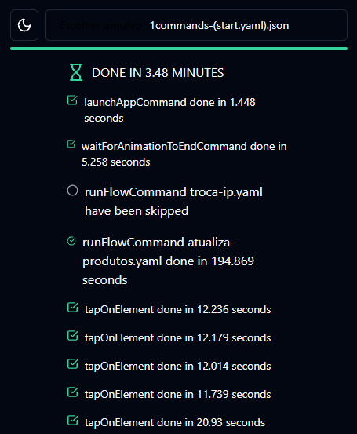
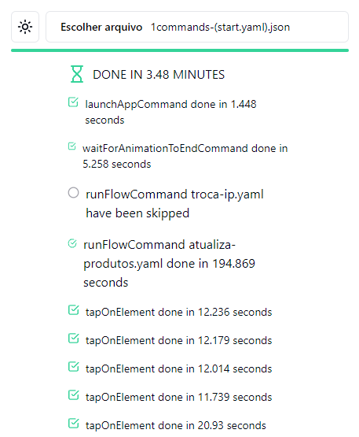

# maestro-log-interpreter


### Developed using [electron-vite-react](https://github.com/vitejs/vite/tree/main/packages/create-vite/template-react-ts) project

### Dark theme

### White theme


## 🛫 Quick Setup

```sh
# clone the project
git clone https://github.com/electron-vite/electron-vite-react.git

# enter the project directory
cd maestri-log-interpreter

# install dependency
npm install

# develop
npm run dev
```